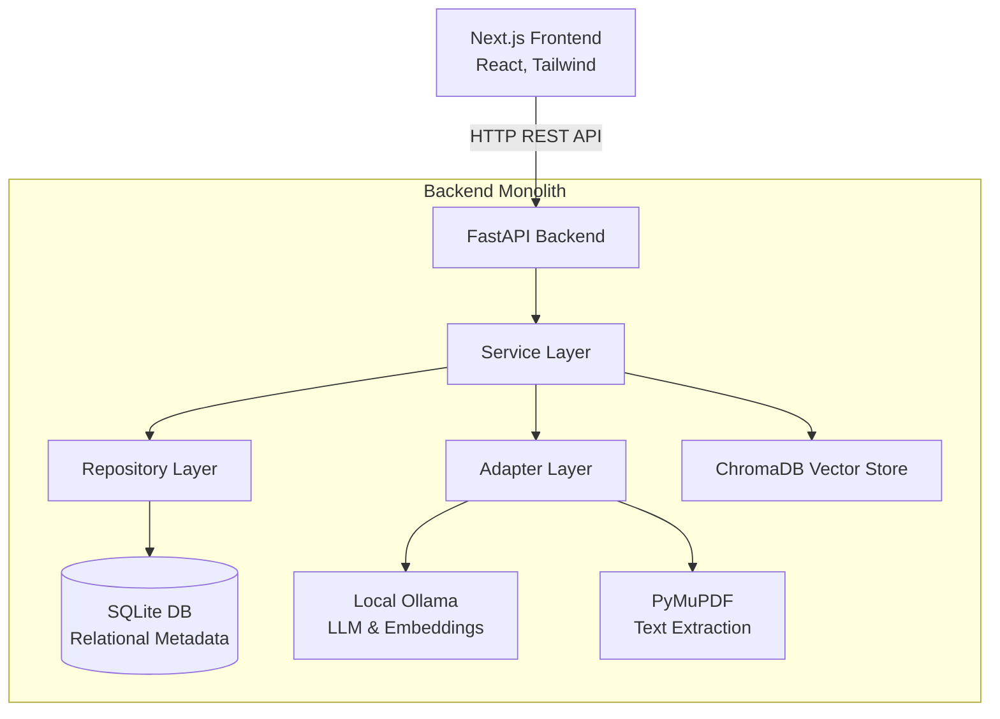
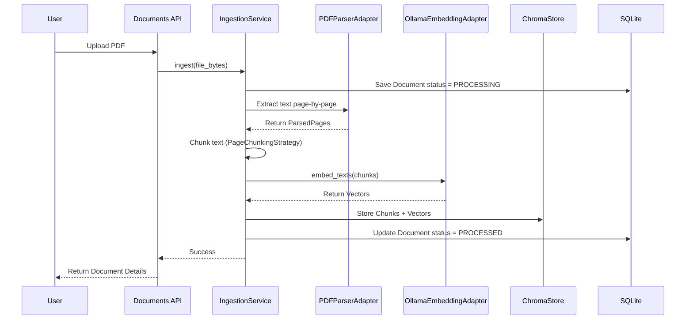
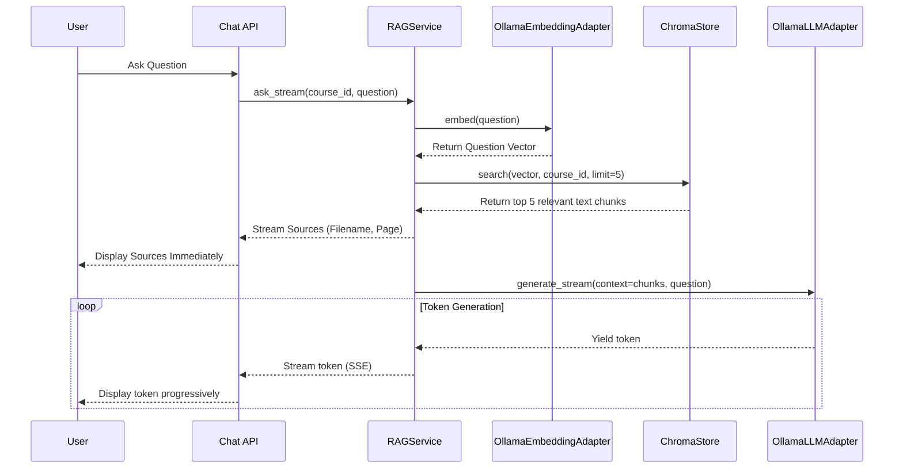

# Nota: Architecture & Design Overview

This document provides a high-level overview of the Nota system architecture, design patterns, and internal data flows. This is intended to help you understand the codebase for future development or technical interviews.

## 1. High-Level Architecture

Nota is built as a **Layered Modular Monolith**. It consists of a React/Next.js frontend that communicates with a FastAPI Python backend. The backend is responsible for all business logic, data processing, and AI integration.

## 2. Design Patterns

The backend strictly follows several software engineering design patterns to keep the code modular, testable, and clean:

### Layered Architecture / Service Layer Pattern
Instead of writing business logic directly inside the API routes, the API routes are completely "dumb". They immediately pass requests to the **Service Layer** (`CourseService`, `IngestionService`, `RAGService`). The Service Layer orchestrates the process.

### Repository Pattern
The Service layer never writes raw SQL queries. Instead, it calls the **Repository Layer** (`CourseRepository`, `DocumentRepository`). This abstracts away the database operations (using SQLAlchemy), meaning if we ever wanted to swap SQLite for PostgreSQL, we would only need to change the Repositories, not the Services.

### Adapter Pattern
We wrap external libraries and APIs (like PyMuPDF and Ollama) in **Adapters** (`PDFParserAdapter`, `OllamaLLMAdapter`). This isolates the rest of the application from third-party code changes. If we decided to swap Ollama for OpenAI, we would just write a new `OpenAIAdapter` without changing the core RAG logic.

### Strategy Pattern
Text chunking uses the Strategy pattern. We defined a base `ChunkingStrategy` interface, and implemented `PageChunkingStrategy`. If we later want to chunk text by paragraphs instead of pages, we can just create a `ParagraphChunkingStrategy` and swap it in.

## 3. Core Pipelines (Internals)

There are two major data flows in Nota: **Ingestion** (uploading a PDF) and **Retrieval** (asking a question).

### A. The PDF Ingestion Pipeline
When a user uploads a PDF, the `IngestionService` takes over.

### B. The RAG Retrieval Pipeline
When a user asks a question, the `RAGService` orchestrates the retrieval-augmented generation. We use Server-Sent Events (SSE) to stream the response back to the client progressively.

## 4. Component Interactions

Here is a breakdown of what interacts with what in the backend:

*   **`app/api/`**: The entry point. Extracts JSON/Form data from HTTP requests, validates it using Pydantic schemas, and calls a Service.
*   **`app/services/`**: Contains the core logic. 
    *   `IngestionService` talks to the `PDFParserAdapter` to get text, `EmbeddingService` to get vectors, `ChromaStore` to save chunks, and `DocumentRepository` to update statuses.
    *   `RAGService` talks to the `EmbeddingService` to vectorize the question, `ChromaStore` to search, and `LLMService` to generate the final answer.
*   **`app/repositories/`**: The only layer that imports `Session` from SQLAlchemy. Reads/writes to SQLite using the models defined in `app/models/`.
*   **`app/adapters/`**: The only layer that imports `httpx` (for Ollama HTTP requests) or `fitz` (PyMuPDF).
*   **`app/vector_store/`**: The only layer that imports `chromadb`. Maintains a persistent connection to the local Chroma DB directory.

## 5. Security & Privacy Context

For an interview context, emphasize that Nota was intentionally built as a **local-first** application.
1.  **Data Sovereignty**: Course materials are never sent to a cloud provider. PDFs are saved locally in `/storage`.
2.  **Private AI**: Vector embeddings and LLM generations run locally via Ollama, preventing third-party data collection.
3.  **Scoped Retrieval**: ChromaDB searches are strictly filtered by `course_id`. A user asking a question in the "Physics" course will mathematically never retrieve text chunks from the "History" course, preventing data contamination.
